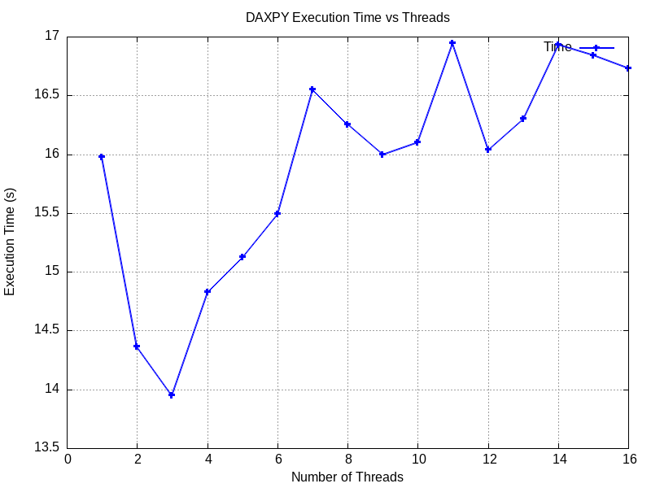

# Question 1: DAXPY Operation Parallelization

## Problem Statement

Implement and analyze the parallel DAXPY (Double-precision A·X Plus Y) operation, a fundamental linear algebra operation commonly used in scientific computing and numerical libraries.

**Operation:** `Y = a*X + Y`

Where:
- `a` is a scalar constant
- `X` and `Y` are vectors of size N

---

### Key Features

- **Embarrassingly Parallel:** Each vector element is computed independently
- **Large Problem Size:** 16 million elements ensure measurable speedup
- **No Data Dependencies:** Perfect for demonstrating parallel scaling
- **Copy-on-Write:** Uses vector copy to prevent memory issues between runs

---

## Results & Visualization

### Performance Metrics

The program generates `daxpy_speedup.txt` containing:
- Column 1: Number of threads
- Column 2: Execution time (seconds)
- Column 3: Speedup factor

### Speedup Graph

The speedup graph shows how performance scales with increasing thread count. Key observations:

- **Linear Scaling (Ideal):** Speedup would equal number of threads (8 threads = 8× speedup)
- **Actual Scaling:** Depends on hardware, memory bandwidth, and overhead
- **Saturation Point:** Speedup plateaus after exceeding physical core count
- **Amdahl's Law:** Serial portions and overhead limit maximum speedup

### Execution Time Graph

This graph demonstrates how execution time decreases as more threads are utilized, showing the benefit of parallelization for computationally intensive operations.

---

## Key Concepts Demonstrated

### 1. Embarrassingly Parallel Problem
- No synchronization required between iterations
- Each thread works on independent data
- Ideal candidate for parallelization

### 2. Work Distribution
- OpenMP automatically divides loop iterations among threads
- Each thread processes approximately N/threads elements
- Default scheduling strategy distributes work evenly

### 3. Performance Analysis
- **Speedup:** Ratio of serial time to parallel time
- **Efficiency:** Speedup divided by number of threads
- **Scalability:** How well performance improves with more resources

### 4. Memory Bandwidth Considerations
- DAXPY is memory-bound (limited by RAM speed, not CPU)
- Performance may plateau due to memory bandwidth saturation
- Multiple threads competing for memory access can limit speedup

---

## Expected Behavior

### On 4-Core System with Hyperthreading (8 logical cores):
- **1-4 threads:** Near-linear speedup (good scaling)
- **5-8 threads:** Diminishing returns due to hyperthreading
- **9-16 threads:** Minimal improvement or performance degradation

### Performance Bottlenecks:
1. **Memory Bandwidth:** Main limitation for DAXPY
2. **Thread Overhead:** Creating and managing threads has cost
3. **Cache Effects:** Data locality and cache line sharing
4. **Hyperthreading:** Logical cores share physical resources

---

## Learning Outcomes

1. ✓ Understanding basic OpenMP parallel loop constructs
2. ✓ Measuring parallel program performance with `omp_get_wtime()`
3. ✓ Analyzing speedup and identifying scaling characteristics
4. ✓ Recognizing memory-bound vs. compute-bound workloads
5. ✓ Visualizing performance data with gnuplot
6. ✓ Understanding Amdahl's Law in practice

---
