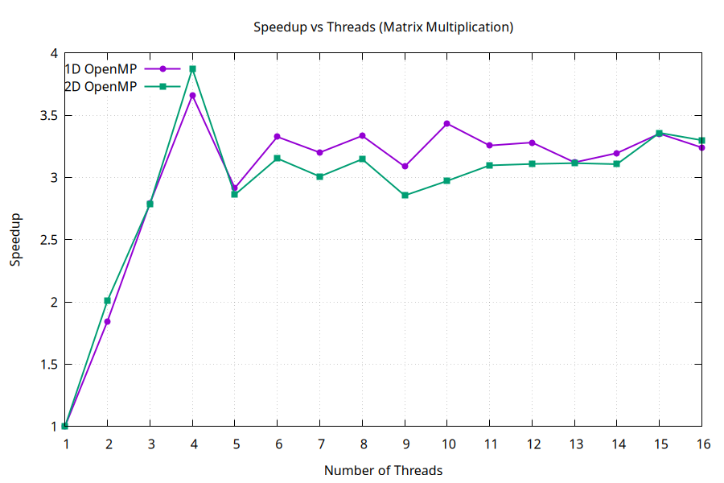

# Question 2: Matrix Multiplication - 1D vs 2D Parallelization

## Problem Statement

Implement and compare two different parallelization strategies for matrix multiplication to understand how different OpenMP directives affect performance and work distribution.

**Operation:** `C = A × B`

Where:
- A, B, and C are 1000×1000 matrices
- Matrix multiplication: `C[i][j] = Σ(A[i][k] × B[k][j])` for k = 0 to n-1

---
**Characteristics:**
- Parallelizes only the outermost loop (rows)
- Each thread processes entire rows independently
- Work distribution: N rows divided among threads
- Granularity: Coarse (one row = 1000 operations)


**Characteristics:**
- Uses `collapse(2)` to parallelize both outer loops
- Creates a combined iteration space of N×N
- Work distribution: Individual matrix elements divided among threads
- Granularity: Fine (one element = single computation)
- Static scheduling with chunk size 64 for cache optimization

---

## Key Differences Between Approaches

| Aspect | 1D Parallelization | 2D Parallelization |
|--------|-------------------|-------------------|
| **Directive** | `parallel for` | `parallel for collapse(2)` |
| **Iteration Space** | 1000 iterations (rows) | 1,000,000 iterations (elements) |
| **Work Unit Size** | One row (1000 elements) | One element |
| **Load Balance** | Good if rows are uniform | Better distribution with more units |
| **Overhead** | Lower (fewer iterations) | Higher (more iterations to manage) |
| **Cache Locality** | Better (processes row sequentially) | Can be optimized with scheduling |
| **Scheduling** | Default (static) | Static with chunk size 64 |

---

## Compilation & Execution

```bash
# Compile with OpenMP support and optimization
g++ -fopenmp -O2 q2.cpp -o q2

# Run the program
./q2

# Generate speedup plot
gnuplot plot.gp
```

---

## Results & Visualization

### Output Format

The program generates `timings.dat` containing:
- Column 1: Number of threads
- Column 2: Execution time for 1D approach (seconds)
- Column 3: Execution time for 2D approach (seconds)
- Column 4: Speedup for 1D approach
- Column 5: Speedup for 2D approach

### Speedup Comparison Graph



The graph compares the speedup characteristics of both parallelization strategies:

**Expected Observations:**

1. **Low Thread Count (1-4 threads):**
   - Both approaches show good speedup
   - 1D may have slight edge due to lower overhead
   - Better cache locality in 1D helps performance

2. **Medium Thread Count (5-8 threads):**
   - 2D approach may start showing advantages
   - Better load balancing with finer granularity
   - More work units to distribute

3. **High Thread Count (9-16 threads):**
   - 2D approach benefits from larger iteration space
   - 1D limited by only 1000 work units
   - With 16 threads, 1D has ~62 rows per thread, 2D has ~62,500 elements per thread

---

## Key Concepts Demonstrated

### 1. Loop Collapse Directive
- `collapse(2)` merges nested loops into single iteration space
- Creates more parallelism opportunities
- Useful when outer loop has insufficient iterations

### 2. Work Granularity
- **Coarse-grained (1D):** Large work units, less overhead
- **Fine-grained (2D):** Small work units, better distribution

### 3. Load Balancing
- 1D: Good if all rows take equal time
- 2D: Better when work is uneven or thread count is high

### 4. Static Scheduling with Chunks
- `schedule(static, 64)` assigns chunks of 64 iterations
- Improves cache locality
- Reduces scheduling overhead
- Chunk size 64 chosen to balance locality and distribution

### 5. Cache Optimization
- Matrix multiplication is cache-sensitive
- Row-major access patterns affect performance
- Blocking/tiling strategies can improve cache utilization

---

## Performance Analysis

### Computational Complexity
- **Operations:** O(n³) = 1 billion multiplications for 1000×1000 matrices
- **Memory Access:** Significantly affects performance
- **Compute-to-Memory Ratio:** Better than DAXPY, more compute-bound

### Speedup Expectations

On a **4-core/8-thread system**:

**1D Approach:**
- Good speedup up to 4 threads (physical cores)
- Moderate improvement 5-8 threads
- Limited by 1000 work units

**2D Approach:**
- Competitive speedup across all thread counts
- Better scaling with high thread counts
- More overhead but better distribution

### Efficiency Factors
1. **Thread Overhead:** Time to create and manage threads
2. **Synchronization:** Barrier at end of parallel region
3. **Memory Bandwidth:** Multiple threads accessing memory
4. **Cache Effects:** False sharing, cache misses
5. **Work Distribution:** Balance between threads

---

## Learning Outcomes

1. ✓ Understanding the `collapse` directive for nested loops
2. ✓ Comparing different parallelization strategies
3. ✓ Analyzing trade-offs between granularity and overhead
4. ✓ Learning about static scheduling and chunk sizes
5. ✓ Understanding cache effects in parallel programs
6. ✓ Recognizing when to use fine vs. coarse-grained parallelism

---

## Advanced Optimization Techniques

### Matrix Multiplication Optimizations:
1. **Loop Tiling/Blocking:** Improve cache utilization
2. **Loop Reordering:** Change k-j-i order for better access patterns
3. **Vectorization:** Use SIMD instructions
4. **Libraries:** Use optimized libraries like BLAS/OpenBLAS

---

## Experiments to Try

1. **Vary Matrix Size:** Test with 500×500, 2000×2000, 4000×4000
2. **Different Schedules:** Try `dynamic`, `guided` instead of `static`
3. **Chunk Sizes:** Experiment with 16, 32, 128, 256
4. **Loop Order:** Change innermost loop order (ikj, jik, etc.)
5. **Measure Cache Misses:** Use performance counters (perf tool)

---

## Conclusion

This experiment demonstrates that **no single parallelization strategy is universally best**. The choice depends on:
- Problem size and structure
- Number of threads available
- Hardware characteristics (cache size, cores)
- Work granularity requirements

Understanding these trade-offs is essential for writing efficient parallel programs.
