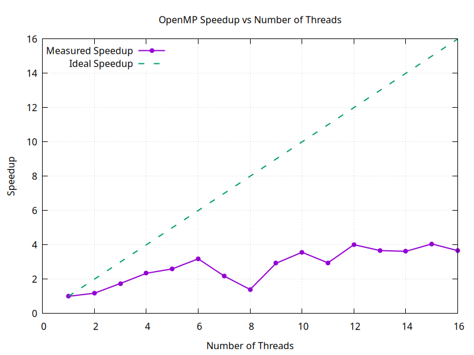

# Question 3: Computing π Using Numerical Integration

## Problem Statement

Calculate the value of π using parallel numerical integration (Riemann sum approximation) with OpenMP reduction to safely accumulate partial sums across multiple threads.

**Mathematical Formula:** 

$$\pi = \int_0^1 \frac{4}{1+x^2} dx$$

This integral evaluates to π because the derivative of arctan(x) is 1/(1+x²), and arctan(1) = π/4.

---

## Implementation Details

### Numerical Integration Approach

The program (`q3.cpp`) uses the **midpoint rule** for numerical integration:

1. **Divide interval [0,1] into n steps:** 10 million steps for high accuracy
2. **Calculate step size:** `step = 1.0 / n`
3. **Evaluate function at midpoints:** For each step i, compute `f(x)` at `x = (i + 0.5) × step`
4. **Sum all contributions:** `π ≈ step × Σf(xᵢ)` where `f(x) = 4/(1+x²)`

### Core Parallel Implementation

```cpp
#pragma omp parallel for num_threads(threads) reduction(+:sum)
for (long i = 0; i < steps; i++) {
    double x = (i + 0.5) * step;
    sum += 4.0 / (1.0 + x * x);
}
double pi = step * sum;
```

**Key Features:**
- **Reduction Clause:** `reduction(+:sum)` ensures thread-safe accumulation
- **Independent Iterations:** Each iteration computes function value independently
- **Private Variables:** Each thread maintains its own partial sum
- **Automatic Combination:** OpenMP combines partial sums at the end

---

## Understanding the Reduction Operation

### Without Reduction (Race Condition):
```cpp
#pragma omp parallel for num_threads(threads)
for (long i = 0; i < steps; i++) {
    double x = (i + 0.5) * step;
    sum += 4.0 / (1.0 + x * x);  // ❌ RACE CONDITION!
}
```
- Multiple threads simultaneously update `sum`
- Results in incorrect, non-deterministic output
- Data race causes lost updates

### With Reduction (Thread-Safe):
```cpp
#pragma omp parallel for num_threads(threads) reduction(+:sum)
for (long i = 0; i < steps; i++) {
    double x = (i + 0.5) * step;
    sum += 4.0 / (1.0 + x * x);  // ✓ SAFE!
}
```
- OpenMP creates private copy of `sum` for each thread
- Each thread accumulates to its own copy
- At the end, all private copies are combined: `sum = sum₁ + sum₂ + ... + sumₙ`
- No locks or critical sections needed

---

## Compilation & Execution

```bash
# Compile with OpenMP support
g++ -fopenmp q3.cpp -o q3

# Run the program
./q3

# Generate speedup plot
gnuplot speedup.gp
```

---

## Results & Visualization

### Output Format

The program generates `speedup.dat` containing:
- Column 1: Number of threads
- Column 2: Speedup factor

Console output includes:
- Number of threads used
- Calculated value of π
- Execution time
- Speedup relative to serial execution

### Speedup Graph



The graph compares **measured speedup** against **ideal linear speedup** (shown as diagonal line):

**Key Observations:**

1. **Near-Linear Scaling (1-4 threads):**
   - Good speedup matching physical core count
   - Minimal overhead from parallelization
   - Compute-bound workload benefits from parallelism

2. **Diminishing Returns (5-8 threads):**
   - Hyperthreading provides some benefit but less than physical cores
   - Overhead becomes more significant
   - Memory bandwidth may become limiting factor

3. **Plateau or Degradation (9-16 threads):**
   - Beyond logical core count, no additional benefit
   - Thread management overhead dominates
   - Context switching reduces efficiency

---

## Key Concepts Demonstrated

### 1. OpenMP Reduction Operation
- **Purpose:** Safe parallel accumulation without explicit locks
- **Syntax:** `reduction(operator:variable)`
- **Supported Operators:** `+`, `*`, `-`, `&`, `|`, `^`, `&&`, `||`, `min`, `max`
- **Mechanism:** Private copies → parallel computation → combine results

### 2. Numerical Integration
- **Riemann Sum:** Approximate integral by summing rectangle areas
- **Convergence:** More steps → better accuracy
- **Parallelization:** Each step is independent, perfect for data parallelism

### 3. Accuracy vs Performance
- 10 million steps provides high accuracy (~10 decimal places)
- Trade-off between precision and computation time
- Parallel execution maintains same accuracy as serial

### 4. Compute-Bound Workload
- Unlike DAXPY (memory-bound), this is compute-intensive
- Each iteration performs division and multiplication
- Better speedup potential compared to memory-bound operations

---

## Mathematical Background

### Why This Integral Equals π

Starting from the derivative:
$$\frac{d}{dx}\arctan(x) = \frac{1}{1+x^2}$$

Integrating both sides from 0 to 1:
$$\int_0^1 \frac{1}{1+x^2}dx = \arctan(1) - \arctan(0) = \frac{\pi}{4} - 0 = \frac{\pi}{4}$$

Multiplying by 4:
$$\int_0^1 \frac{4}{1+x^2}dx = \pi$$

### Midpoint Rule Formula

For n equal subdivisions:
$$\pi \approx \sum_{i=0}^{n-1} f(x_i^*) \cdot \Delta x$$

Where:
- $\Delta x = \frac{1}{n}$ (step size)
- $x_i^* = (i + 0.5) \cdot \Delta x$ (midpoint of interval)
- $f(x) = \frac{4}{1+x^2}$

---

## Performance Analysis

### Expected Speedup

On a **4-core/8-thread Intel i7-11370H**:

| Threads | Expected Speedup | Efficiency |
|---------|-----------------|------------|
| 1       | 1.0×            | 100%       |
| 2       | ~2.0×           | 100%       |
| 4       | ~3.8-4.0×       | 95-100%    |
| 8       | ~5.0-6.5×       | 62-81%     |
| 16      | ~5.5-7.0×       | 34-44%     |

**Efficiency = Speedup / Threads**

### Factors Affecting Performance

1. **Parallel Overhead:**
   - Thread creation and destruction
   - Work distribution among threads
   - Reduction operation combining results

2. **Hardware Limitations:**
   - Only 4 physical cores (hyperthreading helps but limited)
   - Shared resources between hyperthreads
   - Cache contention with many threads

3. **Problem Characteristics:**
   - Compute-intensive (good for parallelization)
   - No synchronization during computation
   - Simple reduction at the end

---

## Comparison with Other Methods

### Alternative π Calculation Methods:

1. **Monte Carlo Method:**
   - Random sampling inside unit circle
   - Highly parallelizable but less accurate
   - Requires random number generation

2. **Leibniz Formula:**
   - `π/4 = 1 - 1/3 + 1/5 - 1/7 + ...`
   - Slower convergence
   - Simpler computation per term

3. **Bailey–Borwein–Plouffe (BBP):**
   - Can compute hexadecimal digits of π
   - Complex formula but interesting properties

4. **Chudnovsky Algorithm:**
   - Extremely fast convergence
   - Used in world-record π calculations
   - Complex implementation

---

## Learning Outcomes

1. ✓ Mastering OpenMP reduction operations
2. ✓ Understanding numerical integration techniques
3. ✓ Avoiding race conditions in parallel accumulation
4. ✓ Analyzing compute-bound vs memory-bound workloads
5. ✓ Measuring and interpreting parallel efficiency
6. ✓ Applying parallelism to mathematical computations

---

## Extensions & Experiments

### Accuracy Experiments:
```cpp
// Test different step counts
long steps[] = {1000, 10000, 100000, 1000000, 10000000, 100000000};
// Observe accuracy vs. computation time trade-off
```

### Different Integration Methods:
```cpp
// Trapezoidal rule
sum += (f(x_i) + f(x_{i+1})) / 2.0;

// Simpson's rule (requires even number of intervals)
// More accurate with fewer steps
```

### Other Reduction Operations:
```cpp
// Find maximum value in array
#pragma omp parallel for reduction(max:max_val)

// Compute product
#pragma omp parallel for reduction(*:product)

// Logical operations
#pragma omp parallel for reduction(&&:all_true)
```

### Performance Profiling:
```bash
# Measure with different optimization levels
g++ -fopenmp -O0 q3.cpp -o q3_O0  # No optimization
g++ -fopenmp -O2 q3.cpp -o q3_O2  # Medium optimization
g++ -fopenmp -O3 q3.cpp -o q3_O3  # Aggressive optimization

# Compare execution times
```

---

## Conclusion

This exercise demonstrates how OpenMP's `reduction` clause elegantly handles a common parallel programming challenge: safely accumulating results from multiple threads. The π calculation problem is an excellent teaching example because:

- It's mathematically interesting and verifiable
- The computation is completely independent across iterations
- It showcases both the power and limitations of parallelization
- Results can be validated against known value (π ≈ 3.14159265359...)

Understanding reduction operations is crucial for many parallel algorithms involving aggregation, such as:
- Statistical computations (sum, mean, variance)
- Finding minimum/maximum values
- Dot products and matrix operations
- Logical queries (all, any, none)
