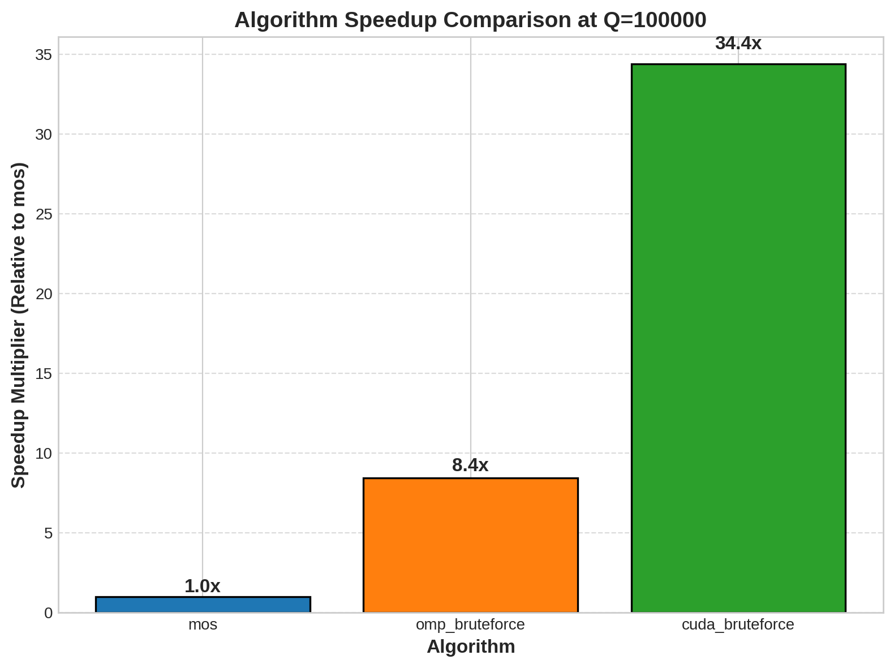
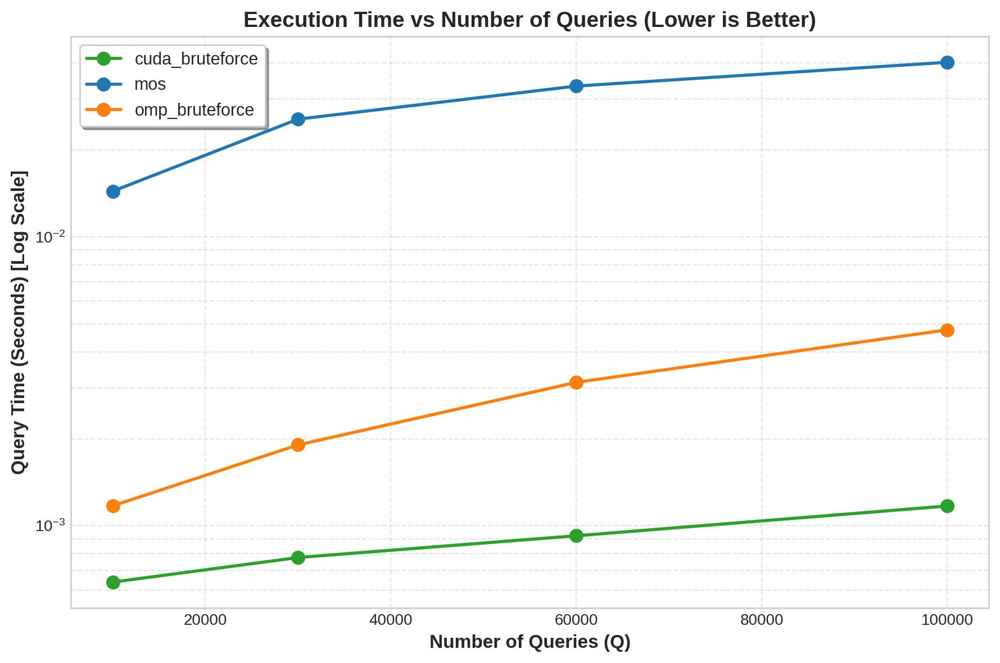
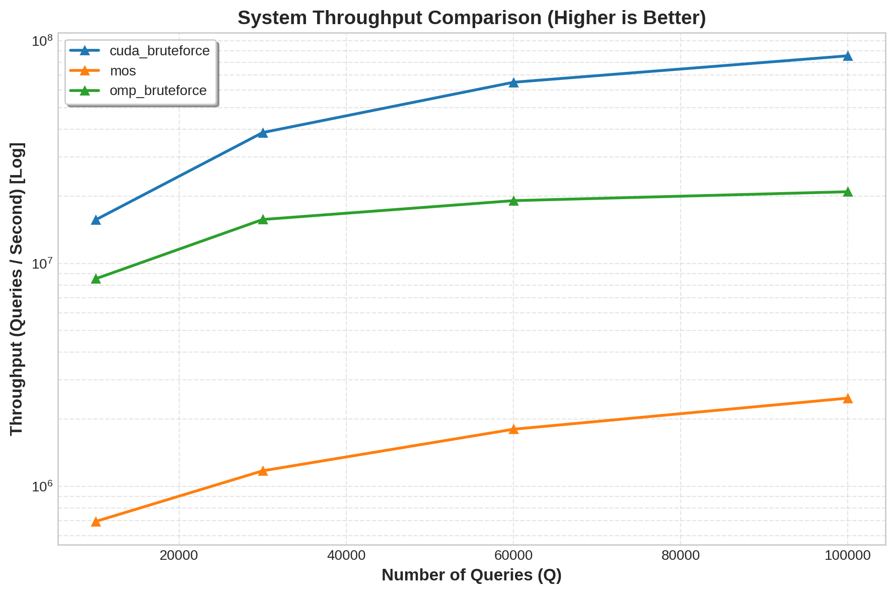
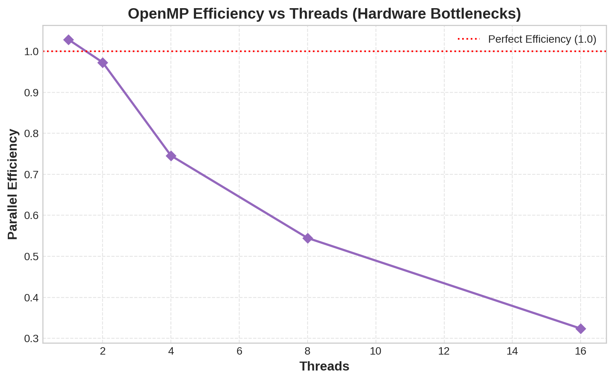

#Architecture-Aware Evaluation of Range Query Processing: Mo\'s Algorithm vs GPU Parallelization


This repository implements a high-performance solution to the offline **Distinct Elements in a Range** problem at production-scale input sizes (`N=1,000,000`, `Q=100,000`).  
It combines algorithmic restructuring, memory-hierarchy optimization, SIMD vectorization, and warp-level GPU execution to push beyond naive asymptotic and hardware limits.

---

## Performance Highlights (TL;DR)

- Three specialized engines target different regions of the hardware-performance envelope: cache-local single-core, multicore SIMD CPU, and warp-centric GPU throughput.
- GPU execution is designed to deliver order-of-magnitude acceleration for high-concurrency workloads with favorable range geometry, while Hilbert-ordered Mo and SIMD OpenMP remain highly competitive in locality-dominant CPU regimes.
- End-to-end benchmarking exports structured metrics (`results/data.csv`) including throughput, speedup, efficiency, and transfer/kernel decomposition.



---

## Problem Statement

Given an immutable array `A[0..N-1]` and a set of offline queries `[L, R]`, compute:

\[
\text{distinct}(L,R) = \left|\{A_i \mid L \le i \le R\}\right|
\]

The central challenge is minimizing repeated work across very large query volumes while respecting the realities of modern hardware: cache locality, memory bandwidth ceilings, vector lanes, thread scheduling overhead, and GPU warp behavior.

---

## The Secret Sauce: Hardware-Driven Optimizations

## 1) Mo's Algorithm (Single-Thread CPU) with 1D Hilbert Curve Ordering

Classical Mo ordering is replaced with **Hilbert curve sorting** over `(L, R)` query coordinates.  
This maps 2D query space to a 1D traversal that minimizes discontinuous window jumps, reducing:

- cache invalidation pressure,
- TLB churn,
- branch and memory-system turbulence from frequent pointer relocation.

The result is improved L1/L2 hit behavior and better steady-state reuse of frequency structures during incremental add/remove operations.

## 2) OpenMP Engine (Multicore CPU) with `prev[]` Transformation + SIMD

The core formulation is mathematically transformed from nested duplicate checks to a single-pass condition using a precomputed previous-occurrence array:

- Build `prev[i] = previous index of A[i]`, or `-1` if first occurrence.
- For query `[L, R]`, count indices where `prev[i] < L`.

This converts expensive irregular work into **sequential memory traversal** with predictable access patterns that synergize with hardware prefetchers.  
At execution time:

- `#pragma omp parallel for` distributes queries across cores.
- `#pragma omp simd reduction(+:cnt)` drives compiler auto-vectorization (AVX2-class lanes) for fast lane-wise accumulation.

## 3) CUDA Engine (GPU) with Warp-Level Parallelism + Warp Reduction

The same `prev[]` logic is ported to GPU execution, but mapped to a warp-centric schedule:

- **One warp per query** (32 threads cooperate on a single range).
- Lanes scan with stride-32, producing naturally coalesced memory traffic for contiguous regions.
- Partial counts are reduced using `__shfl_down_sync()` in-register warp reduction.

This avoids block-wide shared-memory reduction overhead, minimizes synchronization cost, and eliminates divergence-heavy branching patterns typical in naive kernels.

---

## Benchmark Visualizations & Analysis

## Execution Time (Log Scale)

The logarithmic view emphasizes cross-engine separation under increasing query load and highlights where algorithmic locality (Mo) versus raw throughput (OpenMP/CUDA) dominates.



## Throughput (Log Scale)

Throughput reveals the practical service rate under sustained query volume and is the most relevant systems metric for production-style offline analytics pipelines.



## Hardware Limitations (OpenMP)

Efficiency scaling is shaped by memory hierarchy and runtime scheduling behavior:

- **~4 threads:** memory wall begins to appear as per-core gains become bandwidth-limited.
- **~8 threads:** workload/caches can align favorably, yielding a transient efficiency improvement.
- **~16 threads:** oversubscription/scheduler overhead and contention effects reduce marginal speedup.



---

## Data Generation Pipeline

A dedicated generator emits both CSV and binary datasets, including:

- `array.bin`
- `queries_small.bin`
- `queries_medium.bin`
- `queries_large.bin`

The binary path eliminates text parsing overhead and stabilizes benchmarking by decoupling algorithm timing from high-latency I/O tokenization.

---

## Build & Run Instructions

## 1) Compile with aggressive optimization flags

```bash
# CPU engines + benchmark + generator
g++ -O3 -std=c++17 -march=native mos.cpp -o mos
g++ -O3 -std=c++17 -march=native -fopenmp omp_bruteforce.cpp -o omp_bruteforce
g++ -O3 -std=c++17 -march=native input_generator.cpp -o input_generator
g++ -O3 -std=c++17 -march=native -fopenmp benchmark.cpp -o benchmark

# CUDA engine (set arch for your GPU)
nvcc -O3 -std=c++17 -arch=sm_86 cuda_kernel.cu -o cuda_kernel
```

## 2) Generate benchmark datasets

```bash
./input_generator \
  --n 1000000 \
  --q 100000 \
  --value-range 1000000 \
  --seed 42 \
  --out-dir results
```

## 3) Run benchmark suite

```bash
# End-to-end script (build + generate + run)
./run_benchmarks.sh full

# or quick mode
./run_benchmarks.sh quick
```

Manual per-engine execution:

```bash
./mos --n 1000000 --q 100000 --value-range 1000000 --max-len 2048 --seed 42
./omp_bruteforce --n 1000000 --q 100000 --value-range 1000000 --max-len 2048 --threads $(nproc) --seed 42
./cuda_kernel --n 1000000 --q 100000 --value-range 1000000 --max-len 2048 --block-size 256 --seed 42
./benchmark --n 1000000 --value-range 1000000 --seed 42
```

## 4) Generate plots

```bash
python3 plots/plot.py --input results/data.csv --out-dir plots
```

---

## Output Artifact

- Aggregated metrics: `results/data.csv`
- Per-engine logs: `results/mos.log`, `results/omp.log`, `results/cuda.log`
- Benchmark driver log: `results/benchmark.log`
- Figures: `plots/*.png`

---

## Reproducibility Notes

- Pin seeds for deterministic data/query generation.
- Match CUDA architecture flag (`-arch=sm_XX`) to target GPU.
- Compare engines using both latency (`query_sec`) and throughput (`throughput_qps`) to avoid single-metric bias.
